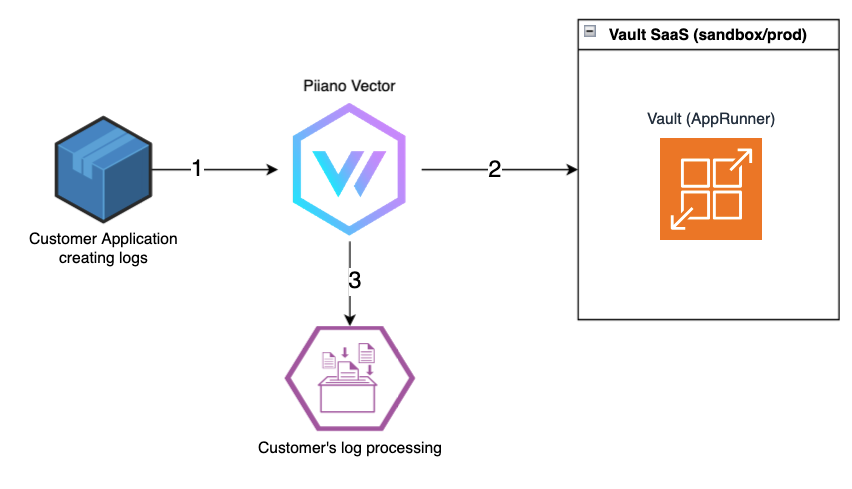

# Log Tokenization 

This project demonstrates how to use Piiano Vault to remove PII from logs .



## Configuration
 .env file should contain:
 all fields in logs that should always be removed , 
 fields that should never contain PII

 Fields in the log that are in neither of these will be analyzed and the recognized PII will be tokenized. 

 Sample file:
 ```
PII_FIELDS=["email","phone","user", "client_id"] # Add all fields from your log that you know contain PII 
NON_PII_FIELDS=["timestamp","action","status","session_id"] # ADD all fields from your log that should never be sent to tokenization
VAULT_API_KEY= # Your vault API KEY
VAULT_URL=# Your vault URL
LOG_COLLECTION="my-logs" # The collection to save the tokenized fields
LOG_FIELD="myField" 

LAMBDA_ENDPOINT= #TEMP UNTIL API IS AVAILABLE
```

## Running the transformation service:

```
pnpm i
pnpm run build
pnpm start

```

## Vector configuration:

Download vector [a vector](https://vector.dev/docs/setup/quickstart/)

# Vector Configuration File (vector.toml)

[a vector configuration](vector.toml)
### Your logs will be the declared as a source:

[sources.my_log_source]
  type = "file"
  include = ["./logs/*large*input*.log"]
  start_at_beginning = true


### Declare a sink for this service (Assuming it runs in localhost:3000) :

[sinks.tokenize_pii]
  type = "http"
  inputs = ["my_log_source"]
  uri = "http://localhost:3000/transform"
  method = "post"
  encoding.codec = "json"
  
[sinks.tokenize_pii.batch]
    max_events = 100
    timeout_secs = 1

### Sink Configuration - write the transformed logs to your original sink

[sources.my_detokenized_log_source]
  type = "file"
  include = ["./logs/transformed.log"]
  start_at_beginning = true

[sinks.console]
  type = "console"  ### For testing only; replace with your desired sink type
  inputs = ["my_detokenized_log_source"]
  encoding.codec = "json"
